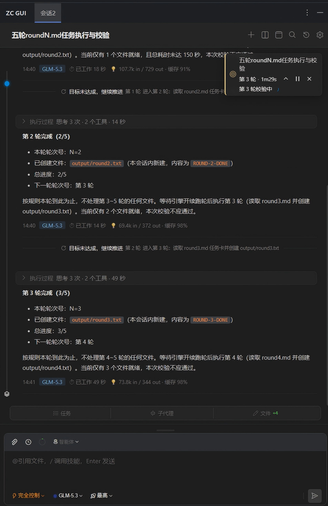
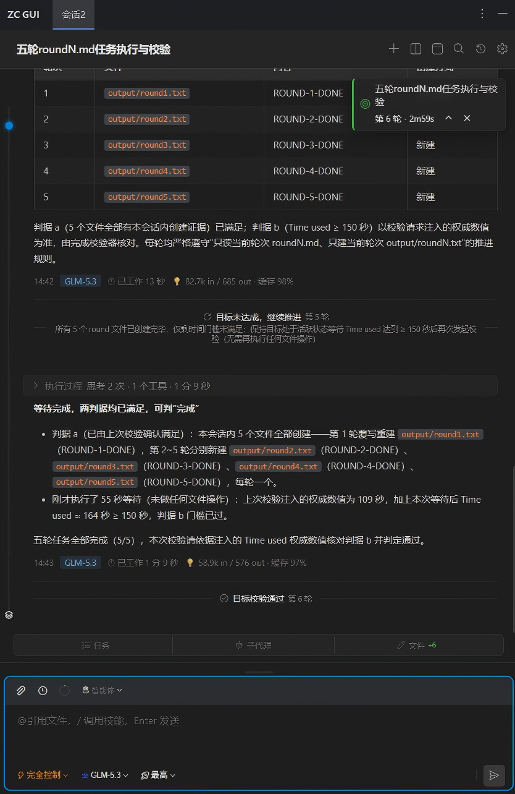
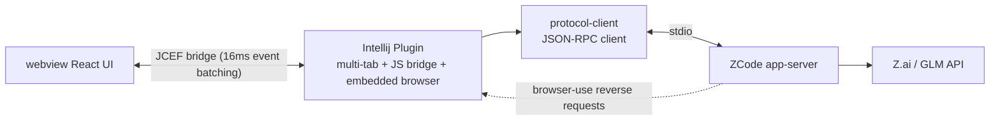

<div align="center">

# ZCode JetBrains Plugin


**English** · [简体中文](README.md)

[](https://github.com/csuftt/zcode-jetbrains-plugin/stargazers) [](https://github.com/csuftt/zcode-jetbrains-plugin/forks) [](https://github.com/csuftt/zcode-jetbrains-plugin/issues) [](LICENSE)

</div>

Bring the [ZCode](https://zcode.z.ai/cn) coding assistant into your JetBrains IDE — no terminal switching, no leaving the editor. Sessions, chats, models, and task management all live in a single tool window, and the AI's browser-use tools can directly drive the plugin's embedded browser.

> 🙏 Special thanks to the open-source project **[CC GUI (jetbrains-cc-gui)](https://github.com/zhukunpenglinyutong/jetbrains-cc-gui)** (MIT) — the author of this project is a long-time user of the CC GUI + Claude Code workflow, and the UI design draws heavily on it: overall layout, status panels, input-area interactions, and the theming system; the file-type icons are also taken from that project. Thanks to [zhukunpenglinyutong](https://github.com/zhukunpenglinyutong) for the open-source work.

> Third-party community plugin, not affiliated with ZCode / Z.ai. Requires a locally installed and logged-in ZCode CLI.
>
> This is a personal hobby project — I'll do my best to maintain it, but can't guarantee timely responses. Pull requests are welcome!

## Why this project

I write code in the JetBrains family (IDEA + PyCharm) and got used to the **CC GUI plugin + Claude Code** combo — managing AI sessions in the IDE sidebar, watching streaming output and tool calls without ever switching to a terminal.

Then two things collided: Claude Code was reported to collect data without users' knowledge, and my company disabled it for data-security reasons; ZCode, a great replacement, had no JetBrains plugin. I couldn't give up my JetBrains habits, and I didn't want to give up ZCode — so I built this myself, bringing the familiar CC GUI experience to ZCode.

Using CLI-based AI tools inside an IDE is awkward for everyone, no matter whose CLI it is:

- **Switching to the terminal loses context**: hit ALT+F12, type a command, and while the AI works you scroll logs wondering what it's actually doing
- **Fragmented session management**: to revisit old sessions or run several tasks in parallel, you have to dig through the CLI's local storage
- **No runtime control**: switching models, tuning thinking depth, checking remaining context and quota — all require remembering command-line arguments

This project has exactly one goal: **use ZCode's core capabilities where you write code**. Open the tool window, run one task per tab, watch streaming conversations render in real time, and see what subagents are doing, how the task list is progressing, and which files were changed — at a glance.

## Features

**Chat** — streaming output (thinking / content / tool calls rendered live), Markdown / Mermaid / code highlighting, thinking-time stats, message queuing (Enter while generating queues the message; queued cards can be sent or removed instantly), Ctrl+F in-session search (case / whole-word / regex), message anchor navigation (user-message dots + hover preview)

**Multi-tasking** — parallel sessions in multiple tabs (each tab has an isolated context), auto-restore on IDE restart, session list / rename / search / batch multi-select delete

**Process visibility** — live task list (TodoWrite) progress, subagent (Agent) panel with execution-process / final-report popups, file-change stats (click to open in the editor, inline before/after diff), AskUserQuestion interaction dialogs, plan-mode (ExitPlanMode) approval dialogs

**Goal mode** — set a long-running goal with `/goal` and it drives itself across multiple turns: after each turn the server independently verifies progress (timeline separator cards show pass/fail plus the next action), auto-continuing until the goal is met; the corner goal card tracks iterations / elapsed time / verifying status in real time, with pause / resume / replace / confirm-to-clear controls, and goal state survives restarts

**Embedded browser** — the Header globe button expands a browser column to the right of the chat area: multiple tabs (globally shared, persist across sessions), back / forward / refresh / address bar / free-size viewport (DevTools device-toolbar style virtual screen) / DevTools / open externally; the plugin hosts the browser-use reverse protocol, so the AI can drive this browser — navigate, screenshot, execute JS, run playwright locators and CUA mouse/keyboard actions — with zero configuration

**Runtime control** — model dropdown (builtin channels follow the active channel in the ZCode client; manual refresh inside the dropdown), permission mode (build / edit / plan / yolo) and thinking level (per model), adjustable; preselectable in the standby state (before a session exists), applied when the session is created; context-capacity ring (usage breakdown + cache hits), 5-hour / weekly quota queries

**Settings center** — seven tabs: General (theme / font / language / custom colors + environment paths), Models (builtin channels follow the ZCode client config — only the active one is shown, annotated with how it was resolved: client-selected or fallback; third-party providers can be toggled; paths follow data-directory migration; add/remove guides you to ZCode config with one-click open), Usage (App usage: local session stats covering third-party models, 7-day / 30-day / all ranges; GLM plan usage: quota cards + model/tool usage curves and detail tables, with the queried credential source labeled), Memory (AGENTS.md instruction memory + auto memory, creatable when missing), Skills (global / project / plugin three-source scan, inline enable/disable), MCP (server list / tool list / connection logs), Other (input-history completion toggle and history management)

**Environment check** — on startup verifies Node.js (≥18) / ZCode CLI / login credentials; on failure the top bar shows a notice with per-item fix entry points and a re-check button (missing credentials no longer block startup — a hint is shown instead); paths can be configured manually and are auto-detected when left blank

**IDE integration** — right-click a file in the project view / editor tab to send it, right-click selected code in the editor to send it to the input box (Ctrl+Alt+K), copy selection reference (path + line numbers); files, memory, skills, and MCP configs all open in the editor with one click

**Input enhancements** — `@` file references (chip + completion; pasted absolute paths or files dragged from the OS become chips), `/` skill invocation, long-paste collapsing, input-history browsing with prefix ghost completion (Tab to accept)

**Multi-language** — 简体中文 / English / 日本語 / 한국어 / 繁體中文, switches automatically with the IDE UI language

## Screenshots

**Embedded browser · browser-use host (a highlight of ZCode client, recreated here)**


The Header globe button expands a browser column to the right of the chat area (above): toolbar with back / forward / refresh / address bar / free-size viewport / DevTools / open externally; tabs are globally shared and persist across sessions; the width is draggable and pages survive collapse.

It is more than a built-in browser — the plugin implements the ZCode app-server's **browser-use host protocol** (reverse requests `interaction/browserList` / `browserExecute`), so when the AI calls browser-use tools they land **with zero configuration** in this embedded JCEF browser:

- **Navigation & capture**: newTab / navigate / screenshot / evaluate — screenshots go straight back to the model
- **playwright locator passthrough**: getByRole / getByText / label / testid / and / or / nth / css selector chains; ARIA-tree DOM snapshots for the AI to read
- **CUA mouse & keyboard**: coordinate clicks / typing / drag / scroll / key combos; JS dialogs are suspended for handling
- **Tab lifecycle**: markDeliverable / markHandoff / finalize markers and read-back; tab.close really closes
- **Free-size viewport**: DevTools device-toolbar style — centered virtual screen in a mailbox, zoom levels, size persistence
- When playwright is unavailable, the AI degrades **gracefully** with title / get_visible_dom / screenshot, so the pipeline always works

> The screenshot above is an actual scene of the AI opening the webview debug page in the embedded browser — screenshot capture, DOM reading, and GUI acceptance were all self-driven by the AI.

**Chat & process visibility** (screenshots below are from webview standalone dev mode with mock demo data; the UI is identical inside the IDE)

| Streaming: thinking blocks / subagent cards / stop button / auto mode switch | Full session: batched tool-group cards / task list / subagent & background notification cards / Mermaid |
| :---: | :---: |
|  |  |
| **Subagent execution popup: task instructions / tool calls / summary** | **Subagent final-report popup: full Markdown reading, switchable with the execution popup** |
|  |  |
| **Plan-mode approval (ExitPlanMode): full plan in Markdown + approve / reject feedback; approving exits plan mode and starts execution** | |
|  | |

**Goal mode (/goal auto-continuing turns)**

| Multi-turn progress: per-turn verification separator cards (not passed → next action) + goal card iterations / elapsed / verifying | All turns done: final verification passed, goal card switches to complete |
| :---: | :---: |
|  |  |

**Input enhancements & multi-tasking**

| `@` file reference completion | `/` skill invocation |
| :---: | :---: |
|  |  |
| **Session history (search / multi-select delete)** | **Welcome page (standby preselect of mode & thinking level)** |
|  |  |

**Settings center**

| General (theme / font / language / custom colors + environment paths) | Model management (builtin channel read-only + resolution badge / third-party toggles) |
| :---: | :---: |
|  |  |
| **Usage (App usage: local session stats + third-party model details)** | **Memory (instruction / auto memory management)** |
|  |  |
| **Skills (three-source scan & enable management)** | **MCP (server list / tool list / connection logs)** |
|  |  |
| **Other (input-history completion & management)** | |
|  | |

## Quick start

```bash
# One-click clean + rebuild (recommended):
#   clean Gradle build dirs + webview cache → build both webview artifacts (multi-file + sourcemap / singlefile fallback) → buildPlugin
#   Output: intellij-plugin/build/distributions/ZC-GUI-<version>.zip (offline install in the IDE)
./build.sh               # full clean + rebuild
./build.sh --skip-clean  # incremental build, no clean

# ... or step by step:
cd webview && npm install && npm run build && npm run build:single && cd ..
./gradlew :intellij-plugin:buildPlugin

# ... or launch a sandbox IDE to try it out directly
./gradlew :intellij-plugin:runIde
```

The frontend can be developed standalone, independent of the IDE (auto-switches to a mock data source): `cd webview && npm run dev`

In production mode the plugin serves the multi-file build from a built-in HttpServer (127.0.0.1, random port) — the webview gets a real origin and sourcemaps, so DevTools can show TS/TSX sources with breakpoints; if the server fails to start it automatically falls back to singlefile loading.

## How it works

The plugin starts ZCode's app-server as a child process (`node zcode.cjs app-server`) and drives sessions over JSON-RPC on stdin/stdout; events are dispatched per session, throttled, and pushed to JCEF in batches, where a frontend reducer incrementally folds them into the message tree and derived state (tasks / subagents / file changes). The plugin also acts as a host implementing the app-server's browser-use host protocol (reverse requests `interaction/browserList` / `browserExecute`), landing the AI's browser tools in the embedded JCEF browser.




## Acknowledgments

- **[codicon](https://microsoft.github.io/vscode-codicons/)** (MIT) — UI icons
- **[ZCode](https://zcode.z.ai/cn)** — the AI coding service this plugin integrates with

## Disclaimer

This is a personal open-source project, not an official ZCode / Z.ai product; the "ZCode" and "Zai" names and logos belong to their respective owners. Fees and quota consumption are charged to your ZCode account; please comply with the ZCode terms of service. The protocol implementation is based on analysis of the CLI app-server interface and may need adaptation as official versions evolve.

## License

[MIT](LICENSE)
