<div align="center">

# ZCode JetBrains 插件

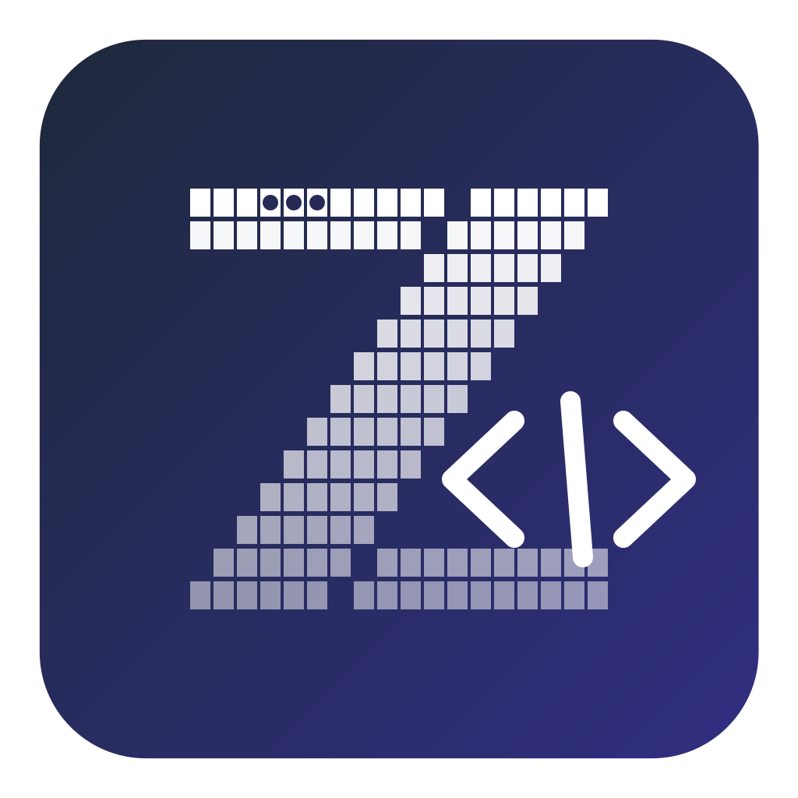

**简体中文** · [English](README.en.md)

[](https://github.com/csuftt/zcode-jetbrains-plugin/stargazers) [](https://github.com/csuftt/zcode-jetbrains-plugin/forks) [](https://github.com/csuftt/zcode-jetbrains-plugin/issues) [](LICENSE)

</div>

把 [ZCode](https://zcode.z.ai/cn) 编码助手带进 JetBrains IDE：不切终端、不离开编辑器，会话、对话、模型与任务管理都在一个工具窗口里完成，AI 的 browser-use 还能直接驱动插件内嵌浏览器干活。

> 🙏 特别感谢开源项目 **[CC GUI（jetbrains-cc-gui）](https://github.com/zhukunpenglinyutong/jetbrains-cc-gui)**（MIT）—— 本项目作者是 CC GUI + Claude Code 工作流的长期用户，UI 设计深度参考了它：整体布局、状态面板、输入区交互、主题体系，文件类型图标亦提取自该项目。感谢作者 [zhukunpenglinyutong](https://github.com/zhukunpenglinyutong) 的开源工作。

> 社区第三方插件，与 ZCode / Z.ai 官方无关。使用前需本机安装 ZCode CLI 并完成登录。
>
> 这是一个个人业余项目，我会尽力维护，但无法保证实时响应。欢迎提交 PR（Pull Request）共同改进。

## 为什么做这个项目

我一直用 JetBrains 全家桶（IDEA + PyCharm）写代码，也早已习惯 **CC GUI 插件 + Claude Code** 的组合——在 IDE 侧栏里管理 AI 会话、看流式输出、追工具调用，不用切终端，工作流非常顺手。

后来两件事撞到了一起：Claude Code 被曝出在用户不知情的情况下收集数据的安全问题，公司出于数据安全考虑禁用了它；而替代品 ZCode 虽然好用，却一直没有 JetBrains 插件。JetBrains 的习惯改不掉，ZCode 也舍不得放弃，于是干脆自己动手——把熟悉的 CC GUI 式体验，搬到 ZCode 上。

其实在 IDE 里用 CLI 型 AI 工具的别扭是共通的，无论哪家的 CLI：

- **切终端丢上下文**：ALT+F12 切到终端敲命令，AI 在干活，你却在滚动日志里翻它到底做了什么
- **会话管理割裂**：想翻历史会话、并行推进几个任务，只能去翻 CLI 的本地存储
- **运行时控制缺位**：切模型、调思考深度、看上下文余量和额度，每次都要记命令行参数

这个项目的目标只有一个：**让你在写代码的地方，就能用上 ZCode 的核心能力**。打开工具窗口，多标签各管一个任务，流式对话实时呈现，子代理在干什么、任务清单进展到哪、改了哪些文件，一目了然。

## 功能一览

**对话** — 流式输出（思考过程 / 正文 / 工具调用实时渲染）、Markdown / Mermaid / 代码高亮、思考耗时统计、消息排队（生成中回车自动排队，排队卡片可立即发送 / 删除）、Ctrl+F 会话内搜索（大小写 / 整词 / 正则）、消息锚点导航（用户消息圆点定位 + hover 预览）

**多任务** — 多标签页并行会话（每标签独立上下文互不串扰）、重启 IDE 自动恢复、会话列表 / 重命名 / 搜索 / 批量多选删除

**过程可视** — 任务清单（TodoWrite）实时进度、子代理（Agent）面板与执行过程 / 最终报告弹窗、文件改动统计（点击在编辑器打开、行内 diff 前后对比）、AskUserQuestion 交互弹窗、计划模式（ExitPlanMode）审批弹窗

**内嵌浏览器** — Header 一键在聊天区右侧展开浏览器分栏：多 tab（全局共享、跨会话沿用）、后退 / 前进 / 刷新 / 地址栏 / 自由尺寸（DevTools 设备工具栏形态的虚拟屏）/ DevTools / 外部打开；插件作为宿主实现 browser-use 反向协议，AI 无需任何配置即可驱动这方浏览器导航、截图、执行 JS、跑 playwright 定位器与 CUA 鼠标键盘操作

**运行时控制** — 模型下拉切换、权限模式（build / edit / plan / yolo）与思考级别（随模型动态）调整，待命态（未建会话）可预选、建会话即生效；上下文容量圆环（含用量构成与缓存命中）、5 小时 / 每周额度查询

**设置中心** — 七页签：基础（主题 / 字体 / 语言 / 自定义配色 + 环境路径）、模型（provider 分组只读清单，路径跟随数据目录迁移，新增 / 删除引导前往 Zcode 配置并可一键打开配置文件）、用量（额度卡片 + 模型 / 工具用量曲线与明细表）、记忆（AGENTS.md 指令记忆 + 自动记忆，缺失可创建）、技能（全局 / 项目 / 插件三来源扫描，行内启用禁用）、MCP（服务器清单 / 工具列表 / 连接日志）、其他（输入历史补全开关与历史记录管理）

**环境检测** — 启动自检 Node.js（≥18）/ ZCode CLI / 登录凭证三件套，异常时顶栏提醒条逐项给出修复入口与重新检测；路径可手动配置，留空自动探测

**IDE 集成** — 项目视图 / 编辑器标签右键发送文件、编辑器右键发送选中代码到输入框（Ctrl+Alt+K）、复制选区引用（路径 + 行号）；文件、记忆、技能、MCP 配置均可一键在编辑器打开

**输入增强** — `@` 引用文件（chip + 补全，粘贴绝对路径自动转 chip）、`/` 调用技能、长文本粘贴折叠、输入历史回溯与前缀幽灵补全（Tab 采纳）

**多语言** — 简体中文 / English / 日本語 / 한국어 / 繁體中文，跟随 IDE 界面语言自动切换

## 界面预览

**内嵌浏览器 · browser-use 宿主（复刻 ZCode 客户端的亮点能力）**

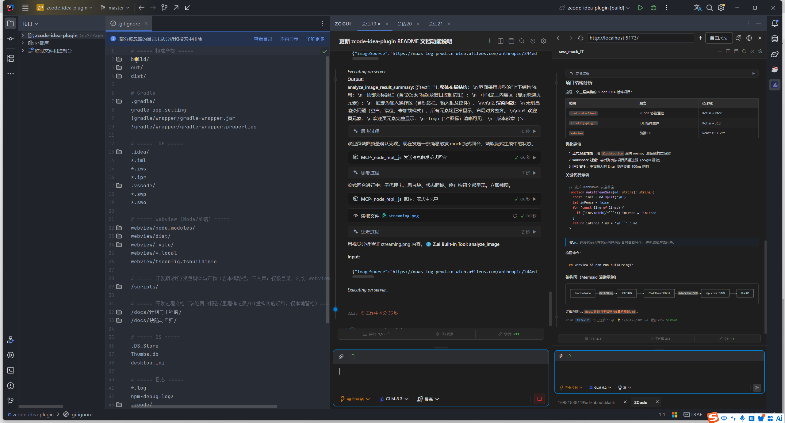

Header 地球按钮在聊天区右侧展开浏览器分栏（上图）：工具条带后退 / 前进 / 刷新 / 地址栏 / 自由尺寸 / DevTools / 外部打开，多 tab 全局共享、跨会话沿用，宽度可拖拽调整、收起后页面保留。

它不只是一个内置浏览器——插件实现了 ZCode app-server 的 **browser-use 宿主协议**（`interaction/browserList` / `browserExecute` 反向请求），AI 调用 browser-use 工具时**零配置**落到这方 JCEF 浏览器执行：

- **导航与采集**：newTab / navigate / screenshot / evaluate，截图直接回传模型
- **playwright 定位器透传**：getByRole / getByText / label / testid / and / or / nth / css 链等选择器引擎，ARIA 树 DOM 快照供 AI 读取
- **CUA 鼠标键盘**：坐标点击 / 输入 / 拖拽 / 滚动 / 组合按键，JS 对话框自动挂起处理
- **tab 生命周期**：markDeliverable / markHandoff / finalize 标记与回读，tab.close 真关闭
- **自由尺寸**：DevTools 设备工具栏形态——虚拟屏居中信箱、缩放档、尺寸持久化
- playwright 能力不可用时，AI 可用 title / get_visible_dom / screenshot 组合**优雅降级**，链路始终可用

> 上图即 AI 在内嵌浏览器中打开 webview 调试页的实际场景——截图、DOM 读取、GUI 验收全程由 AI 自驱完成。

**对话与过程可视**（以下截图取自 webview 独立开发模式，mock 演示数据，界面与 IDE 内完全一致）

| 流式生成中：思考块 / 子代理卡 / 停止按钮 / 模式自动切换 | 完整会话：批量工具组卡 / 任务清单 / 子代理与后台通知卡 / Mermaid |
| :---: | :---: |
| 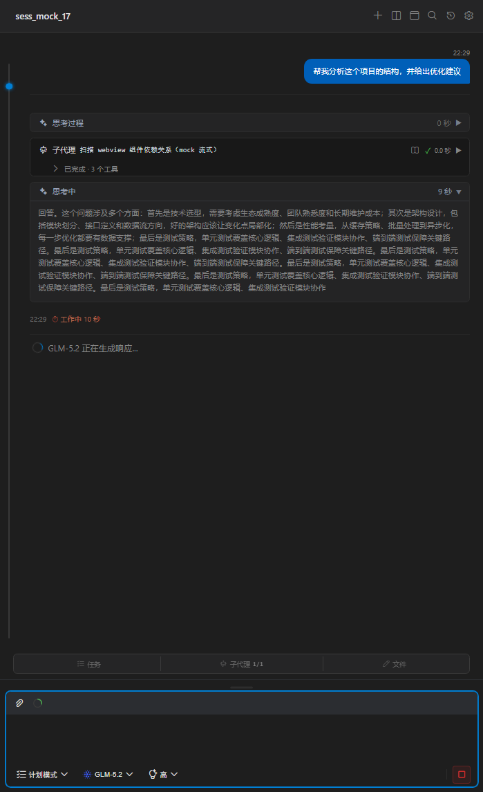 | 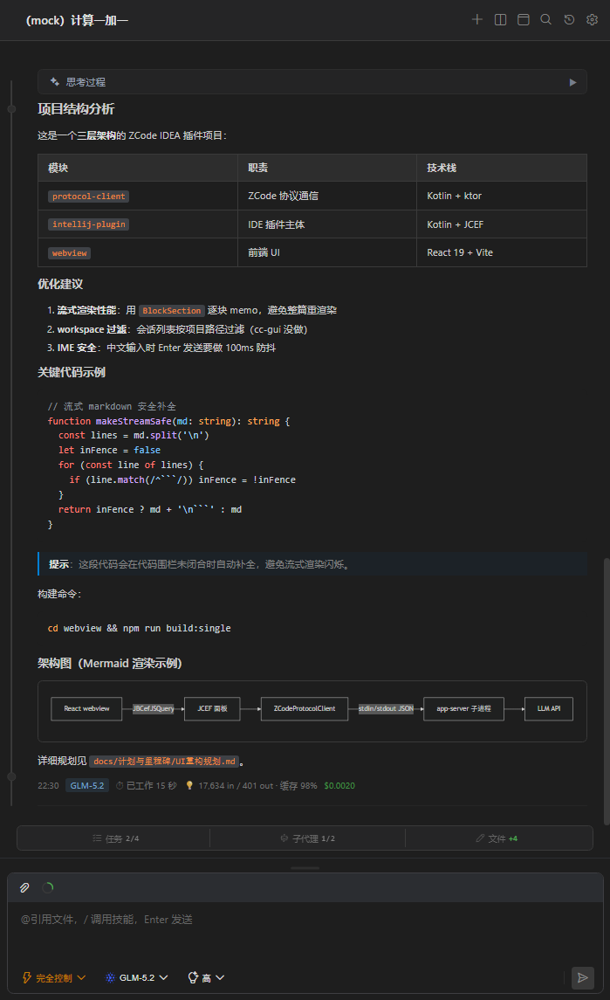 |
| **子代理执行过程弹窗：任务指令 / 工具调用 / 总结** | **子代理最终报告弹窗：Markdown 全文阅读，可与过程弹窗互切** |
| 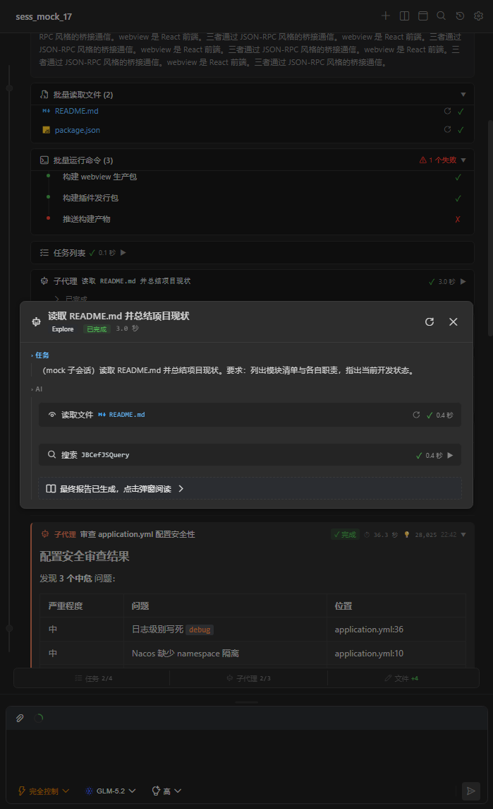 | 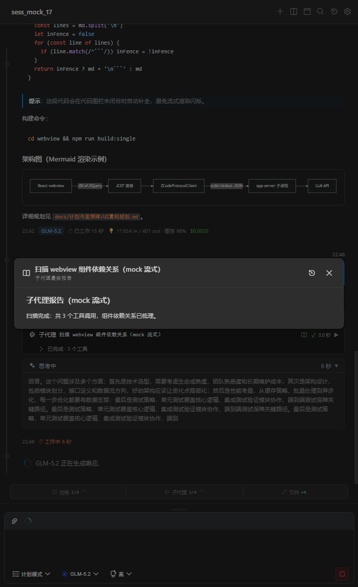 |

**输入增强与多任务**

| `@` 引用文件补全 | `/` 技能调用 |
| :---: | :---: |
| 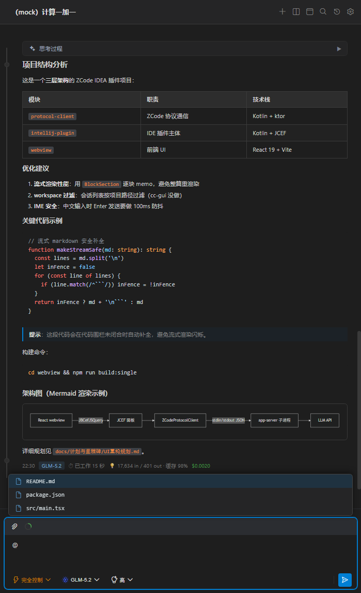 | 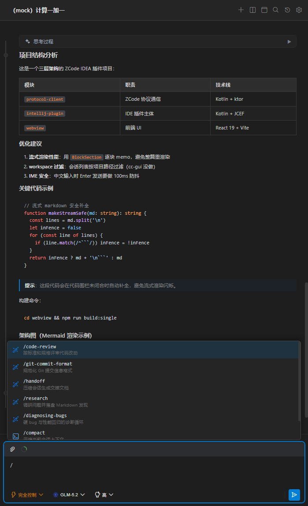 |
| **历史会话（搜索 / 多选删除）** | **欢迎页（待命态可预选模式与思考级别）** |
|  |  |

**设置中心**

| 基础设置（主题 / 字体 / 语言 / 自定义配色 + 环境路径） | 模型管理（provider 分组只读清单 / 增删引导前往 Zcode 配置） |
| :---: | :---: |
| 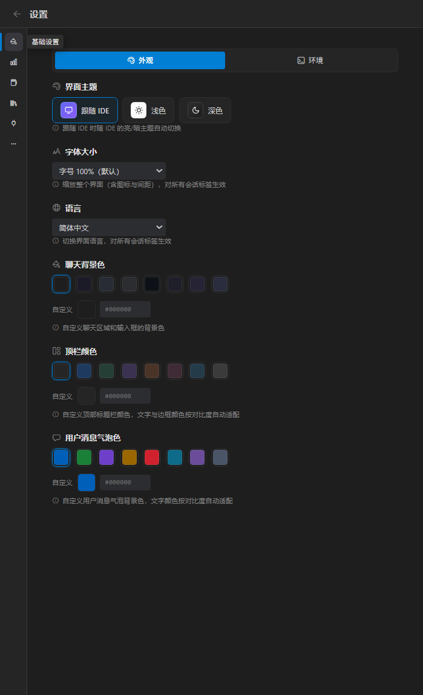 | 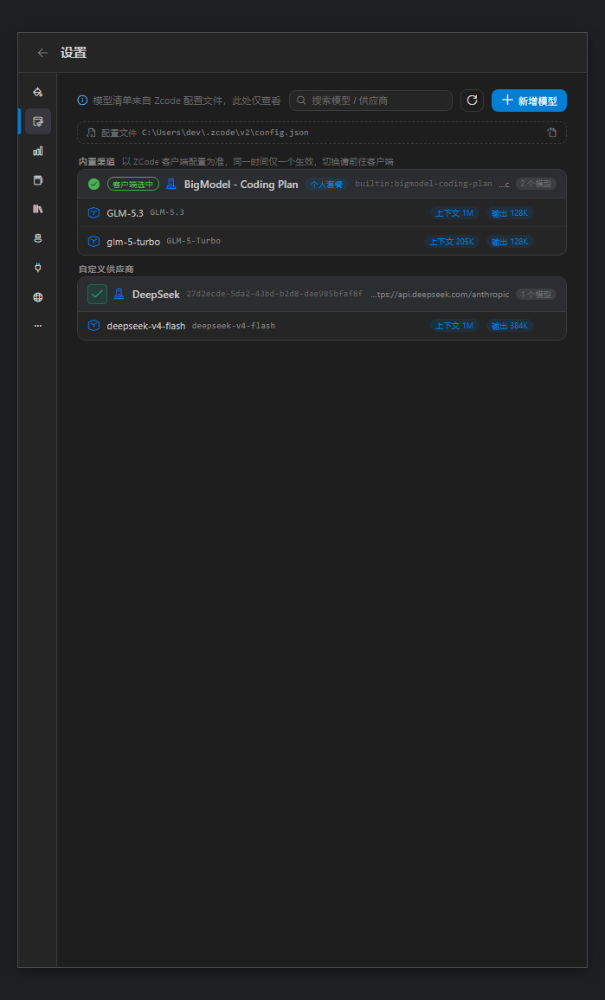 |
| **用量查询（额度卡片 / 模型与工具用量曲线）** | **记忆（指令 / 自动记忆管理）** |
| 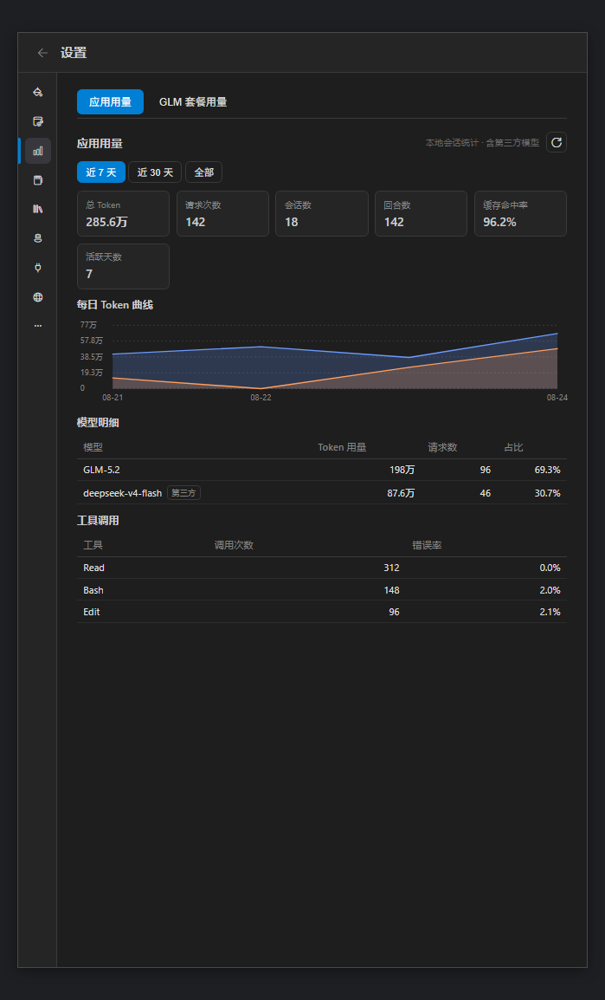 | 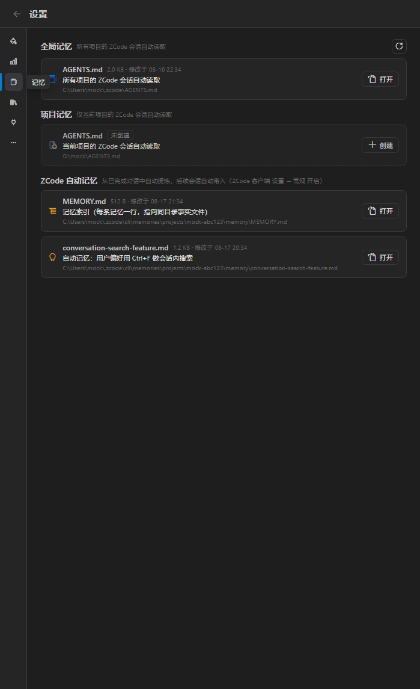 |
| **技能（三来源扫描与启用管理）** | **MCP（服务器清单 / 工具列表 / 连接日志）** |
|  |  |
| **其他（输入历史补全与管理）** | |
| 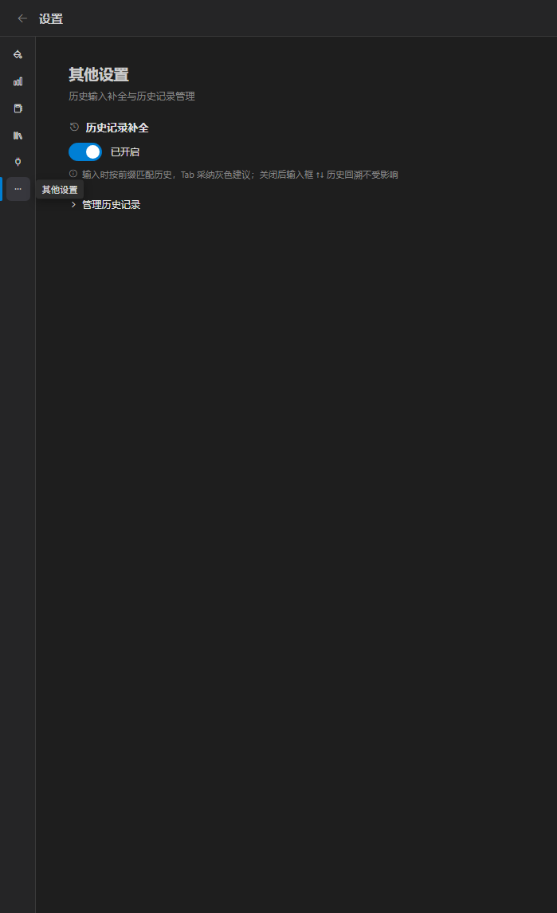 | |

## 快速开始

```bash
# 一键清理 + 重建（推荐）：
#   清 Gradle 构建目录 + webview 缓存 → 双产物构建（多文件+sourcemap / singlefile fallback）→ buildPlugin
#   产物：intellij-plugin/build/distributions/ZC-GUI-<版本>.zip（IDE 内离线安装）
./build.sh               # 完整清理 + 重建
./build.sh --skip-clean  # 跳过清理，仅增量构建

# 或分步执行：
cd webview && npm install && npm run build && npm run build:single && cd ..
./gradlew :intellij-plugin:buildPlugin

# 或启动沙箱 IDE 直接体验
./gradlew :intellij-plugin:runIde
```

前端可脱离 IDE 独立开发（自动切换 mock 数据源）：`cd webview && npm run dev`

生产模式下插件会用内置 HttpServer（127.0.0.1 随机端口）serve 多文件产物——webview 拥有真实 origin 与 sourcemap，DevTools 中可直接看 TS/TSX 源码断点；server 启动失败时自动降级 singlefile 单文件加载。

## 开发约定

- **禁止强推 master**：CI 与发布流程都基于 master，不要用 `git push --force` / `-f` 改写已推送历史；需要修正时用 `git revert` 或追加新提交。GitHub 的分支保护（拒绝强推）需 Pro 或公开仓库，当前私有免费仓库未启用，靠本约定约束。

## 发布到 JetBrains Marketplace

首次上架需在 plugins.jetbrains.com 网页手动完成；后续版本更新由 GitHub Actions 自动发布。

### 首次上架（一次性）

1. 注册 JetBrains 账号并创建个人访问令牌：[plugins.jetbrains.com/author/me/tokens](https://plugins.jetbrains.com/author/me/tokens)
2. 生成签名密钥对：`./scripts/gen-signing-key.sh`（产物在 `~/.zcode/plugin-signing/`，项目外不入库；重复生成需先手动删除旧目录）
3. 本地跑兼容性验证：`./gradlew :intellij-plugin:runPluginVerifier`（首次会下载多个 IDE 版本，耗时较长）
4. `./build.sh` 产出发行包 `intellij-plugin/build/distributions/ZC-GUI-<版本>.zip`
5. 在 [plugins.jetbrains.com/upload](https://plugins.jetbrains.com/upload) 手动上传 zip，并填写 Marketplace 描述、许可证、截图

### 后续更新（自动）

打 tag（如 `v0.1.1`）即触发 `.github/workflows/release.yml`：构建 → 兼容性验证 → 签名 → 发布到 stable 渠道。仓库需配置以下 Secrets：

| Secret | 来源 |
| --- | --- |
| `MARKETPLACE_TOKEN` | 第 1 步创建的令牌 |
| `CERTIFICATE_CHAIN` | `cat ~/.zcode/plugin-signing/chain.crt` 的内容 |
| `PRIVATE_KEY` | `cat ~/.zcode/plugin-signing/private.pem` 的内容 |
| `PRIVATE_KEY_PASSWORD` | 生成密钥时传入的密码（无密码则留空） |

> 发布前注意事项：
> - 版本号需保持 4 处一致：`intellij-plugin/build.gradle.kts` 的 `version`、`webview/package.json`、`McpToolsClient.kt`、`WelcomeScreen.tsx`；tag 名必须为 `v<版本>`，CI 会校验 tag 与 build.gradle.kts 版本一致
> - 在 `CHANGELOG.md` 顶部新增版本块（其最新版本块会作为插件 change-notes 展示）
> - 更新 `until-build` 兼容范围前先跑 `runPluginVerifier` 验证

## 工作原理

插件以子进程方式启动 ZCode 的 app-server（`node zcode.cjs app-server`），通过 stdin/stdout 上的 JSON-RPC 驱动会话；事件流按会话分发、节流批量推入 JCEF，前端 reducer 增量归约为消息树与任务 / 子代理 / 文件改动等派生状态。插件同时充当宿主，实现 app-server 下行的 browser-use 宿主协议（`interaction/browserList` / `browserExecute` 反向请求），把 AI 的浏览器工具落到内嵌 JCEF 浏览器上执行。

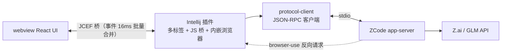


## 致谢

- **[codicon](https://microsoft.github.io/vscode-codicons/)**（MIT）— 界面图标
- **[ZCode](https://zcode.z.ai/cn)** — 本插件对接的 AI 编码服务

## 免责声明

本项目为个人开源项目，非 ZCode / Z.ai 官方产品；"ZCode"、"Zai" 名称与图标版权归其所有者所有。使用产生的费用与额度消耗由你的 ZCode 账号承担，请遵守 ZCode 服务条款。协议实现基于对 CLI app-server 接口的分析，随官方版本升级可能需要适配。

## License

[MIT](LICENSE)
