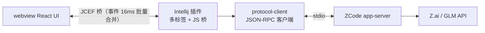

# ZCode IDEA Plugin

把 [ZCode](https://zcode.z.ai/cn) 编码助手带进 JetBrains IDE：不切终端、不离开编辑器，会话、对话、模型与任务管理都在一个工具窗口里完成。

> 🙏 特别感谢开源项目 **[CC GUI（jetbrains-cc-gui）](https://github.com/zhukunpenglinyutong/jetbrains-cc-gui)**（MIT）—— 本项目作者是 CC GUI + Claude Code 工作流的长期用户，UI 设计深度参考了它：整体布局、状态面板、输入区交互、主题体系，文件类型图标亦提取自该项目。感谢作者 [zhukunpenglinyutong](https://github.com/zhukunpenglinyutong) 的开源工作。

> 社区第三方插件，与 ZCode / Z.ai 官方无关。使用前需本机安装 ZCode CLI 并完成登录。

## 为什么做这个项目

我一直用 JetBrains 全家桶（IDEA + PyCharm）写代码，也早已习惯 **CC GUI 插件 + Claude Code** 的组合——在 IDE 侧栏里管理 AI 会话、看流式输出、追工具调用，不用切终端，工作流非常顺手。

后来两件事撞到了一起：Claude Code 被曝出在用户不知情的情况下收集数据的安全问题，公司出于数据安全考虑禁用了它；而替代品 ZCode 虽然好用，却一直没有 JetBrains 插件。JetBrains 的习惯改不掉，ZCode 也舍不得放弃，于是干脆自己动手——把熟悉的 CC GUI 式体验，搬到 ZCode 上。

其实在 IDE 里用 CLI 型 AI 工具的别扭是共通的，无论哪家的 CLI：

- **切终端丢上下文**：ALT+F12 切到终端敲命令，AI 在干活，你却在滚动日志里翻它到底做了什么
- **会话管理割裂**：想翻历史会话、并行推进几个任务，只能去翻 CLI 的本地存储
- **运行时控制缺位**：切模型、调思考深度、看上下文余量和额度，每次都要记命令行参数

这个项目的目标只有一个：**让你在写代码的地方，用完 ZCode 的全部能力**。打开工具窗口，多标签各管一个任务，流式对话实时呈现，子代理在干什么、任务清单进展到哪、改了哪些文件，一目了然。

## 功能一览

**对话** — 流式输出（思考过程 / 正文 / 工具调用实时渲染）、Markdown / Mermaid / 代码高亮、思考耗时统计、消息排队（生成中回车自动排队）、Ctrl+F 会话内搜索

**多任务** — 多标签页并行会话（每标签独立上下文互不串扰）、重启 IDE 自动恢复、会话列表 / 重命名 / 删除

**过程可视** — 任务清单（TodoWrite）实时进度、子代理（Agent）面板与执行过程详情弹窗、文件改动统计、AskUserQuestion 交互弹窗、计划模式（ExitPlanMode）审批弹窗

**运行时控制** — 模型下拉切换、权限模式与思考级别调整、上下文容量圆环、5 小时 / 每周额度查询

**输入增强** — `@` 引用文件（chip + 补全）、`/` 调用技能、长文本粘贴折叠、输入历史回溯

## 快速开始

```bash
# 一键清理 + 重建（推荐）：
#   清 Gradle 构建目录 + webview 缓存 → 双产物构建（多文件+sourcemap / singlefile fallback）→ buildPlugin
#   产物：intellij-plugin/build/distributions/ZC-GUI-<版本>.zip（IDE 内离线安装）
./build.sh               # 完整清理 + 重建
./build.sh --skip-clean  # 跳过清理，仅增量构建

# 或分步执行：
cd webview && npm install && npm run build && npm run build:single && cd ..
./gradlew :intellij-plugin:buildPlugin

# 或启动沙箱 IDE 直接体验
./gradlew :intellij-plugin:runIde
```

前端可脱离 IDE 独立开发（自动切换 mock 数据源）：`cd webview && npm run dev`

生产模式下插件会用内置 HttpServer（127.0.0.1 随机端口）serve 多文件产物——webview 拥有真实 origin 与 sourcemap，聊天页 Header「开发者工具」按钮可直接看 TS/TSX 源码断点；server 启动失败时自动降级 singlefile 单文件加载。

## 工作原理

插件以子进程方式启动 ZCode 的 app-server（`node zcode.cjs app-server`），通过 stdin/stdout 上的 JSON-RPC 驱动会话；事件流按会话分发、节流批量推入 JCEF，前端 reducer 增量归约为消息树与任务 / 子代理 / 文件改动等派生状态。



设计与实现细节（协议调研、里程碑、缺陷回归记录）见 [`docs/`](docs/README.md)。

## 致谢

- **[codicon](https://microsoft.github.io/vscode-codicons/)**（MIT）— 界面图标
- **[ZCode](https://zcode.z.ai/cn)** — 本插件对接的 AI 编码服务

## 免责声明

本项目为个人开源项目，非 ZCode / Z.ai 官方产品；"ZCode"、"Zai" 名称与图标版权归其所有者所有。使用产生的费用与额度消耗由你的 ZCode 账号承担，请遵守 ZCode 服务条款。协议实现基于对 CLI app-server 接口的分析，随官方版本升级可能需要适配。

## License

[MIT](LICENSE)
