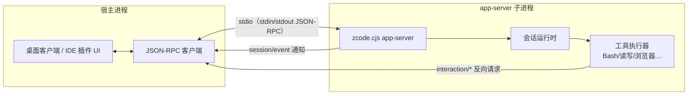

# ZCode App-Server 协议参考（非官方）

> **免责声明**：本文档非 Z.ai 官方文档，由 ZC-GUI 插件开发过程中对 ZCode CLI 的静态分析与协议实测逆向整理而来，仅供第三方集成参考。协议随 CLI 版本演进可能随时变化，以官方发布为准。
>
> **基准版本**：ZCode CLI 0.16.5（2026-08-28 构建），部分条目附 0.16.1（2026-08-09 构建）对照。
> **使用情况**：表中「ZC-GUI」列表示 [ZC-GUI](https://github.com/csuftt/zcode-jetbrains-plugin) JetBrains 插件（v0.3.1 开发中快照）对该 API 的使用状态——✅ 使用中 / ⬜ 未使用。供同样基于 app-server 做集成的开发者参考。

## 1. 概述

ZCode 桌面客户端与本插件采用同一后端形态：以子进程方式启动 `zcode.cjs app-server`，通过 stdio 上的 JSON-RPC 2.0 驱动 AI 编码会话。app-server 承担会话管理、模型调用、工具执行、事件推送等全部后端职责，宿主（桌面客户端 / IDE 插件）只负责 UI 与用户交互。



要点：

- **启动**：`node <zcode.cjs 路径> app-server`。zcode.cjs 位于 ZCode 桌面客户端安装目录的 `resources/glm/` 下。无握手步骤——进程拉起后即可直接发请求。
- **凭证**：通过环境变量注入（`ZCODE_MODEL`、`ZCODE_BASE_URL`、`ANTHROPIC_API_KEY` 等），或依赖 `~/.zcode/` 下客户端自身的凭证链。插件实际注入的凭证取自 `~/.zcode/v2/config.json` 的 provider 注册表，与桌面客户端共享。
- **stderr 必须持续读取**：app-server 会向 stderr 输出错误堆栈，操作系统管道缓冲有限（Windows 约 4KB），无人读取会导致 node 进程阻塞在写 stderr 上，表现为所有请求超时而进程仍存活。stderr 同时是后端模型 API 错误（如 429 配额超限）的第一现场。

## 2. 传输与消息约定

- stdio 上按行分帧的 JSON-RPC 2.0（UTF-8，一行一个 JSON 对象）。
- 三个消息方向：
  1. **请求**（宿主 → 服务端，带 `id`）：普通方法调用；
  2. **反向请求**（服务端 → 宿主，带 `id`，方法名多为 `interaction/*`）：服务端需要宿主侧的用户交互或能力（提问、权限审批、浏览器操作等），**宿主必须应答**，无法处理的应回 JSON-RPC error（如 -32601），不应挂起不答；
  3. **通知**（服务端 → 宿主，无 `id`）：两个通道——`session/event`（legacy，会话内全部事件：流式增量、工具状态、回合生命周期等）与 `v4/conversation/frame`（V4 订阅增量帧，见 §4.4）。

## 3. RPC 方法清单

### 3.1 会话生命周期

| 方法 | 语义 | ZC-GUI |
|---|---|---|
| `session/create` | 创建会话，参数含 `workspace {workspacePath, workspaceKey}` 与 `mode`（权限模式），返回会话对象 | ✅ |
| `session/list` | 按工作区列会话（分页）。**0.16.5 实测坑**：① CLI 原样落库 `workspacePath`——正/反斜杠双形态并存时单形态查询各丢一半，宿主查询需双形态并集、写入需归一；② 内存补列不排子代理会话（`sess_subagent_*`），混入主列表需前缀过滤 | ✅ |
| `session/subscribe` | 订阅会话事件流（subscribe 前会话须处于活跃状态，冷会话会报 -32004，先 `session/resume`） | ✅ |
| `session/resume` | 恢复/激活历史会话（跨进程的会话在本进程未激活时，一切操作前都需先 resume） | ✅ |
| `session/send` | 发送消息驱动回合；支持 `attachments` 附件、`toolDenylist`、`automationId`（定时任务触发）等特殊输入 | ✅ |
| `session/stop` | 停止当前回合。**注意**：0.16.5 起 legacy 通道的 stop 存在失效回归（见 §4.3），建议改用 V4 stop | ✅（兜底路径） |
| `session/close` | 关闭会话（释放运行时） | ✅ |
| `session/read` | 读会话详情快照：`runtime`（模型、contextUsage 等）、`settings`（模式/思考级别）、`activeTurnKind` 等 | ✅ |
| `session/messages` | 拉取会话消息列表（含每个 turn 的 parts 结构） | ✅ |
| `session/subagents` | 子智能体会话列表（主会话派生的 agent 会话及状态）。**实测缺陷**：`ended.items` 只收录 `status=success` 条目，失败的子会话被整体丢弃——失败子代理的 `childSessionId` 无从获取，宿主只能展示 Agent 工具 part 自带的 `state.error` | ✅ |
| `session/usage` | 会话级用量 | ✅ |
| `session/events` | 按 `afterSeq`/`limit` 拉历史事件（断线补发） | ⬜ |
| `session/fork` | 从 checkpoint 或 messageId 分叉新会话，继承 mode/model/thoughtLevel | ⬜ |
| `session/goal` | 长目标生命周期（set/replace/show/pause/resume/clear，pause 会中止当前回合） | ⬜ |
| `session/cancelBackgroundTask` | 取消后台任务 | ✅ |

### 3.2 会话配置

| 方法 | 语义 | ZC-GUI |
|---|---|---|
| `session/setModel` | 切换会话模型（`modelId` + `providerId`，可携带 `runtimeModel` 完整覆盖）。注意：回合运行中直接 setModel 会终止当前回合，需延迟到回合结束补发 | ✅ |
| `session/updateRuntimeModelConfig` | 更新运行时模型配置（上下文 limit / modalities 等客户端侧覆盖） | ✅ |
| `session/setMode` | 设置权限模式（build / plan / default / yolo 等） | ✅ |
| `session/setThoughtLevel` | 设置思考级别（级别集因模型而异，如 off/high/max） | ✅ |

### 3.3 工作区

| 方法 | 语义 | ZC-GUI |
|---|---|---|
| `workspace/generateText` | 无会话一次性文本生成（带 `operationId` 可取消）——适合输入润色等轻量场景，避免冷启动整个会话。未注册时报 -32603，先 `upsertModelProvider` 注册目标模型即可自愈 | ✅ |
| `workspace/cancelGenerateText` | 取消 generateText | ⬜ |
| `workspace/upsertModelProvider` | 注册/更新自定义模型 provider（apiKey 可用 `{source:"env"}` 引用环境变量避免明文） | ✅ |
| `workspace/removeModelProvider` | 移除自定义 provider | ⬜ |
| `workspace/readState` | 一次读全工作区状态（模型目录 / providers / 设置 / thoughtLevels） | ⬜ |
| `workspace/setDefaultModel` | 设工作区默认模型 | ⬜ |
| `workspace/setDefaultThoughtLevel` / `setDefaultMode` / `updateInteractionPreferences` / `updateModelIoPreferences` / `updateProviderRegistry` | 工作区级配置写 | ⬜ |
| `workspace/hooks/trustGrant` | 授信 workspace hook 声明 | ⬜ |

### 3.4 MCP 与插件

| 方法 | 语义 | ZC-GUI |
|---|---|---|
| `mcp/list` | 列 MCP 服务器及连接状态（`workspace` + `mode`） | ✅ |
| `plugins/list` | 已安装插件清单（含 `declaredMcpServerNames` / `hostMcpServerNames`——后者是 CLI 内置注册表声明的宿主侧 MCP server，不在磁盘配置里） | ✅ |
| `plugins/referenceCatalog` / `setEnabled` / `overview` | 插件引用目录 / 启停 / 概览 | ⬜ |
| `plugins/marketplace/add·remove·update` / `install` / `uninstall` / `update` / `cancelOperation` / `restoreBuiltin` / `configure` / `validate` / `describe` | 插件市场全套 | ⬜ |

### 3.5 用量

| 方法 | 语义 | ZC-GUI |
|---|---|---|
| `usage/stats` | App 级用量统计：`range` + `timeZone` → 总量（含 reasoning / cache 读写 / TTFT / 错误数）、回合总量、按模型 / 按工具聚合、按天明细。**无工作区（项目）维度**——按项目统计需宿主自建台账 | ✅ |
| `session/usage` | 会话级用量 | ✅ |

配套的还有订阅套餐限额查询 HTTP 接口（用 `~/.zcode/v2/config.json` 中 provider 的 apiKey 认证），属 HTTP 面而非 app-server RPC，此处不展开。

## 4. V4 会话协议（v4/*）

### 4.1 背景

官方桌面客户端同样 spawn `zcode.cjs app-server`，但**不走上述 legacy `session/*` 通道驱动会话**，而是走 V4 会话协议：事件以帧（frame）形式经订阅通道推送、操作以命令（command）形式经统一入口下发、消息排队收编为服务端原生能力。legacy `session/*` 是兼容垫片层——V4 面并非新近才有，0.16.1 已注册 19 个 `v4/*` 方法，0.16.5 为 23+。

### 4.2 方法与命令

信封（`v4/command` 实测可用形状）：

```json
{
  "commandId": "<uuid>",
  "clientId": "<宿主标识>",
  "sessionId": "<sess_...>",
  "type": "<命令类型>",
  "payload": { },
  "issuedAt": 1787900000000,
  "connectionId": "<连接标识>",
  "clientMode": "desktop-continuous"
}
```

方法（0.16.5）：`v4/conversation/subscribe·resync·unsubscribe·frame`、`v4/command`、`v4/commands/query`、`v4/connection/flow`、`v4/controller/subscribe·resync·unsubscribe`、`v4/attachment/begin·chunk·commit·abort·read`（大附件分块）、`v4/telemetry/event`、`v4/conversation/rowsRange·plans·fileChanges·fileRewindPreview·usage`、`v4/usage/stats`。

命令类型（`v4/command` 的 `type`）：`createSession` / `sendText`（`requestedDelivery: startNow·queue·guide`）/ `sendGoalCommand` / `stop` / `compact` / `forkAssistant` / `applyFileRewind` / `editUserQuery` / `retryTurn` / `setAssistantFeedback` / `sendQueuedNow` / `editQueueItem` / `reorderQueueItem` / `deleteQueueItem` / `setAutoDrain` / `resolveInteraction` / `answer` / `switchModelConfig` / `switchCollaborationMode` / `setFollowupMode` / `pauseGoal` / `resumeGoal` / `cancelBackgroundWork` / `renameSession` / `deleteSession`。

其中服务端原生消息队列（`sendText` 的 `queue` 投递 + `sendQueuedNow` / `editQueueItem` / `reorderQueueItem` / `deleteQueueItem` 编辑族）是官方客户端「排队秒发」体验的实现基础。

**ZC-GUI 使用情况**（v0.3.1 起）：`v4/command`（`type=stop`）与 `v4/conversation/subscribe·unsubscribe`——✅，其余 ⬜。后者是子智能体会话实时流的数据源（legacy `session/subscribe` 对子会话假成功、无事件，见 §4.4），收到 `v4/conversation/frame` 通知后映射回 legacy 事件形态复用既有消费逻辑。裸 `v4/command` 不需要先建立任何 v4 订阅，`connectionId` 可自造；`v4/conversation/subscribe` 则需要 `topic=conversation/<sessionId>` + `connectionId` + `clientMode`（缺 `clientMode` 报 ZodError）。

### 4.4 订阅帧结构实测（0.16.5，2026-09-01 捕获）

`v4/conversation/subscribe`（`clientMode=desktop-continuous`，不带 base）成功后先推一帧 initial snapshot，随后增量帧实时到达 `v4/conversation/frame` 通知：

- **snapshot 帧**：`payload = {kind:"snapshot", snapshot:{rows:{window:[…行数组]}}}`。window 是尾部窗口（实测 `snapshotTailWindowRows=60` 行），长会话只有近尾部内容；回放时宿主应把已有 UI 状态对齐到快照再消费增量。
- **行类型**：`userInput`（user prompt）/ `turnHeader`（回合头）/ `assistantText` / `reasoning` / `toolCall`。
- **toolCall 行关键字段**：`toolCallId` / `toolName` / `status`（`inputStreaming · pendingApproval · running · success · error · cancelled`）/ `inputText`（参数 JSON 文本）/ `input`（已解析对象）/ `output {text}` / `error {code, message}` / **`startedAt` / `endedAt`（毫秒 epoch，optional）**。时间戳是工具耗时的权威数据源；仅消费 legacy `tool.updated` 事件的宿主拿不到精确起止，只能本地计时。
- **增量 op**：`row.appended` / `row.upserted`（整行替换，`inputText` 为**累积全文**，宿主自行 diff 出增量）/ `row.delta`（`append` 追加文本）；`state.updated` / `row.removed` 等与本映射无关。
- **消费建议**：v4 帧与 legacy 事件形态差异大，宿主可做一层映射器（快照回放标记 deliveryKind 供前端区分、upsert 累积文本按长度 diff、时间戳原样透传）——ZC-GUI `V4FrameMapper` 即此做法。

### 4.3 停止回合的相位差异（0.16.1 → 0.16.5 实测）

- `v4/command {type:"stop"}` 在新旧版本上均可用，底层原语会立即中止运行时追踪的前台执行（实测 30–40ms 生效），且停完立即可复用会话、无冷却期。
- **工具执行阶段**停止：legacy `session/event` 流会在约 40ms 内收到真实的 `turn.completed`（含 `tool_cancelled` / batch 收尾）。
- **纯流式输出阶段**停止：引擎侧同样立即终止，但 legacy 事件流**不会发出终止帧**（15s 观察窗内无）——只消费 legacy 流的客户端需自行合成收口（按 turnId 守卫，防止误杀用户随后开的新回合）。
- 0.16.5 上 legacy `session/stop` 失效（点了没反应），0.16.1 正常——这正是 ZC-GUI 采用「V4 stop 优先、`session/stop` 兜底（-32601 时回退，覆盖无 V4 的老版本）」策略的原因。

## 5. 服务端反向请求（宿主应答）

| 方法 | 语义 | 应答要点 | ZC-GUI |
|---|---|---|---|
| `session/requestRuntimePreferences` | 服务端询问运行时偏好 | **必须应答**，否则对应请求永久挂起：`{nativeSearchEnhancementsEnabled, memoryEnabled, askUserQuestionAutoResolutionEnabled}` | ✅ |
| `interaction/requestUserInput` | AskUserQuestion 弹窗 | `{action, content:{answer}}`；须异步处理（宿主侧等待用户选择会阻塞，不能卡在 reader 线程） | ✅ |
| `interaction/requestPermission` | 工具授权审批（default「变更前询问」模式） | 顶层 `{decision: allow·deny·escalate·modify, modifiedInput?, permissionUpdates?}`；不实现会被 -32601 短路 → 服务端按拒绝处理 | ✅ |
| `interaction/browserList` | 宿主浏览器枚举（browser-use） | `{browsers:[…]}`；无宿主浏览器能力回空列表（协议允许，按不可用降级） | ✅ |
| `interaction/browserExecute` | 宿主浏览器命令执行 | 按命令返回 execute result；无能力回 -32601 | ✅ |
| `interaction/requestProviderRuntimeHeaders` | provider 运行时请求头刷新 | 回 `{headersApplied:false}` 表示不处理 | ⬜（当前回 -32601） |
| `automation/create·update·delete·list·checkTaskBinding` | 定时任务宿主化 | 见下 | ⬜ |

反向请求处理铁律：**一律异步应答**——reader 线程被阻塞会导致整个协议通道停摆。

### automation/* 定时任务要点

- `create` 参数：`cronExpr`（默认 `"* * * * *"`）/ `relativeDelayMinutes` / `prompt` / `title` / `recurring` / `maxRuns` / `intervalUnit + interval`（1–200，与 cron/delay 互斥）/ `model` / `mode` / `thoughtLevel` / `targetTaskId`（绑定既有会话）/ `botDeliveryTarget`。
- `checkTaskBinding` 未实现时服务端会容错回退到 `automation/list` 查询（-32601 可容忍），宿主可先只实现 create + list。
- **架构定性**：app-server 自身无调度器，到点触发是宿主的责任（宿主到点以 `session/send {automationId, content: prompt}` 驱动）；宿主不运行则任务静默。各宿主（桌面客户端 / IDE 插件）的任务存储互不可见。

## 6. 事件流（session/event）

订阅后服务端以通知推送 `session/event`，payload 含 `sessionId`、`seq`（单调递增，配合 `session/events` 的 `afterSeq` 可断线补发）、`type` 与各类型自有字段。常见事件类型（节选）：

| 类别 | 事件类型 |
|---|---|
| 回合生命周期 | `turn.started` / `turn.completed` / `turn.failed` |
| 消息与流式 | `message.updated`；`model.streaming`（含 `tool_input_start·delta`、文本 delta 等） |
| 工具执行 | `tool.updated`（result/batch 类帧无 toolName 字段）、`tool_call_scheduled`；精确起止时间戳见 §4.4 的 v4 toolCall 行（`startedAt`/`endedAt`） |
| 检查点 | `checkpoint_created`（payload 含 checkpointId / targetMessageId / scope / snapshotRef）；文件变更台账随 `model_complete` 事件（`fileChanges.items[{path, additions, deletions}]`） |
| 后台任务 | `background_task_started·updated·completed` |
| 权限 | `permission_requested·resolved·denied` |
| 其他 | `rewind_triggered`、`target_changed`、`session_input_promoted`、`queue_auto_drain_changed`、`stream_recovery_*`、`hook_run_*` 族 |

注意 todo 列表不是独立事件：TodoWrite/TodoRead 是 agent 内部工具，宿主要展示须从 `tool_call_*` 事件解析工具参数。

## 7. 常见错误码

| 错误码 | 语义 | 处置 |
|---|---|---|
| `-32004` | Session is not active——跨进程会话在本进程未激活（CLI 升级/重启后常见） | 先 `session/resume` 再重试原请求 |
| `-32010` | 发送撞上挂死的回合 | 先停止回合再重试 |
| `-32031` | 会话恢复告警（模型配置丢失） | `send`/`resume` 时携带 `runtimeModel`；`requestProviderRuntimeHeaders` 未按约应答也会触发 |
| `-32601` | 方法不存在（标准 JSON-RPC） | 版本能力差异探针：V4 不在场的老 CLI 对 `v4/command` 回此码 |
| `-32602` | 参数非法（标准 JSON-RPC） | 如空 workspacePath |
| `-32603` | 内部错误（标准 JSON-RPC） | 如调用未注册模型的方法（`workspace/generateText` 未注册模型时）、MCP 配置损坏 |

## 8. ZC-GUI 集成实践要点

以下经验来自插件开发实战，对同类集成（自建客户端、CI 宿主、测试工具）应有直接参考价值：

1. **stderr 持续 drain**（§1）——最高优先级，否则表现为随机全请求超时。
2. **冷会话恢复**：任何请求都可能撞 -32004，统一封装「resume 后重试」比逐点处理省事；并发 resume 需去重。
3. **回合中改配置的时序**：回合运行中 `setModel` 会终止回合，UI 语义上应延迟到 `turn.completed` 后补发；等待期间用户选回当前模型则取消补发。
4. **停止策略**：V4 stop 优先（毫秒级、无冷却），-32601 回退 `session/stop`；纯流式期停止后 legacy 流无终止帧，客户端须按 turnId 守卫自行合成收口（§4.3）。
5. **反向请求全部异步处理**，且服务端可能对同一请求无限重试/换 id 重发——宿主要做请求级去重（共享 pending 等待）。
6. **能力探针**：对 `v4/command` 发一个 `stop`（空闲会话）或探测方法注册表，可在运行时区分 CLI 是否具备 V4 面，据此选择通道。
7. **无会话生成**用 `workspace/generateText` 常驻通道，比冷启动一个完整会话（CLI `-p` 一次性调用）轻量得多。

---

*最后更新：2026-09-01 · 基于 ZCode CLI 0.16.5 · ZC-GUI v0.3.1（开发中）使用快照*
