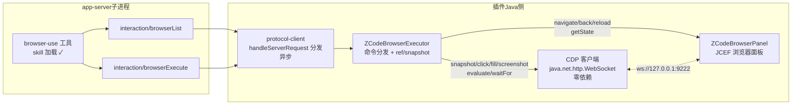

# browser-use 宿主协议接入设计（方案 A：对齐 ZCode 原生）

> 日期：2026-08-15
> 目标：ZCode 原生 browser-use 功能在插件模式下直接可用——不加 MCP、不加插件、不加 skill。
> 原理：实现 app-server 的**浏览器反向请求**宿主协议（桌面客户端由主进程 executor 实现，插件由 Java 侧实现），AI 的 browser 工具调用经 stdio JSON-RPC 落到插件的 JCEF 内嵌浏览器上。

## 一、协议规格（逆向 zcode.cjs v3.7.7 实测确认）

### 反向请求 1：`interaction/browserList`
- params：`{requestId, sessionId, turnId?, workspaceKey, workspacePath, workspaceIdentity?, remoteSessionId?, clientMode, sessionContext}`
- result：`{browsers: [...]}`，browser 结构：

```ts
{
  id: string,                    // 稳定标识（插件用 "idea-iab"）
  generation: number,            // 递增代数（重启/重建浏览器时 +1）
  type: "iab" | "extension" | "cdp",   // 插件报 "iab"（内嵌浏览器）
  name: string,                  // 显示名（"IDEA 内嵌浏览器"）
  capabilities: {                // 能力清单——只报已实现的命令！
    browser?: [{id, description}],     // 如 "navigate"/"screenshot"
    tab?: [{id, description}]
  },
  apiSupportOverrides?: Record<string, boolean>,
  metadata?: Record<string, string>
}
```

### 反向请求 2：`interaction/browserExecute`
- params：`{requestId, sessionId, turnId?, browserId?, browserGeneration?, workspaceKey?, ..., command}`
- command：`discriminatedUnion("method")`，**全集 38 个**：

```
导航：navigate / back / forward / reload
观测：snapshot / screenshot / getState / elementInfo / getDialog / waitFor / listUserTabs
交互：click / fill / type / press / cuaKeypress / scroll / cuaScroll / domCuaScroll /
      hover / select / check / drag / cuaDrag / handleDialog
脚本：evaluate / playwright / playwrightWaitForTimeout / capabilities
面板：browserVisibilityGet / browserVisibilitySet / browserViewportReset
tab： activateTab / newTab / claimTab / finalizeTabs / markDeliverable / markHandoff /
      nameSession / finalize
会话：turnEnded / closeSession / cancelRequest / close / list
```

- result：

```ts
{
  ok: boolean,
  state?: {url, title, canGoBack, canGoForward, scrollX?, scrollY?, viewportWidth?, viewportHeight?},
  snapshot?: {url, title,
    dom?: [{tag, depth, inViewport, ref?, role?, name?, text?, attributes?}], domTruncated?,
    elements: [{ref, tag, role?, name?, text?, value?, disabled?, checked?,
                selector, xpath, rect, inViewport, parentRef?, framePath?, attributes?}],
    truncated},
  image?: {base64, mimeType: "image/png"},       // screenshot 结果
  tabs?, userTabs?, tab?,                        // tab 管理
  value?: unknown,                               // evaluate 结果
  element?, dialog?,
  error?: {code, message, sideEffect?: "none"|"uncertain"},
  meta: {browserUse: true, backendType, browserId, browserGeneration,
         openTabIds, tabId?, currentUrl?, lifecycle?: "active"|"deliverable"|"handoff"|"closed"},
  elapsedMs: number
}
```

- 生命周期：turn 结束时 app-server 对每个 browser 批量发 execute（`cancelRequest` 等 sendLifecycle 命令）——须幂等空应答。

### 插件端现状（失败根因）
`ZCodeProtocolClient.handleServerRequest` 对未知反向请求回 `-32601` → app-server 报"宿主不支持浏览器反向请求"。反向请求框架现成（`interaction/requestUserInput` 先例：**必须异步 handler，禁止阻塞 reader 线程**）。

## 二、架构



关键决策：
1. **CDP 走 JCEF 默认开的 9222**（registry `ide.browser.jcef.debug.port`）：screenshot=`Page.captureScreenshot`、snapshot/evaluate=`Runtime.evaluate` 注入脚本、click/fill=`Input.dispatchMouseEvent`（trusted 事件，React onChange 可靠响应）。
2. **navigate/back/forward/reload/getState 走 JCEF 原生 API**（不经 CDP，快且稳）。
3. **ref 语义**：snapshot 时 evaluate 注入遍历脚本，`ref` 直接用生成的稳定 xpath（selector 字段本来就要求 xpath），click/fill by ref = `document.evaluate` 定位——无需维护服务端元素表，DOM 变化天然容错。
4. **截图前面板上屏**：execute 到浏览器命令时 EDT 里把浏览器 Content 设为 selected（对齐桌面端 ScreenshotSurfacePrepare 语义）。

## 三、风险点

| 风险 | 说明 | 对策 |
|---|---|---|
| 9222 target 定位 | 聊天 webview 也在 9222 上，多 target 混淆 | Phase 1 单浏览器面板：按 `cefBrowser.url` 在 `/json/list` 匹配；失配时回退过滤掉已知聊天 origin（127.0.0.1:内置端口/localhost:5173）；后续实验 `CefBrowser.getIdentifier()` 与 targetId 关联 |
| 9222 被占/被关 | 端口冲突 CEF 静默换端口或禁用 | 启动时探测 9222 `/json/version`，失败则 browserList 返回空列表（browser-use 优雅降级），并在日志提示 registry 改端口 |
| execute 阻塞 reader | 协议铁律 | 复用 requestUserInput 模式：pooled thread 执行 + respondToServer |
| 命令集大 | 38 个全实现工期长 | 分阶段：未实现命令返回 `{ok:false, error:{code:"unsupported"}}` 而非卡死 |

## 四、分阶段计划

- **Phase 1（打通闭环）**：协议分发 + executor + browserList（单 iab）+ navigate/back/forward/reload/getState（JCEF）+ screenshot/evaluate/snapshot/waitFor/click/fill/type/press/scroll/hover（CDP）+ 生命周期空应答。AI 可完成"打开 dev server → 截图 → 点击 → 断言"的前端调试主流程。
- **Phase 2（体验完善）**：多 tab（newTab/activateTab/list，浏览器面板内多 Content）、handleDialog/getDialog（CefJSDialogHandler）、elementInfo/select/check/drag、浏览器面板自动唤起（browserVisibility*）。
- **Phase 3（对齐细节）**：playwright 透传命令、claimTab/listUserTabs、nameSession/finalize 语义、apiSupportOverrides 精细化。
