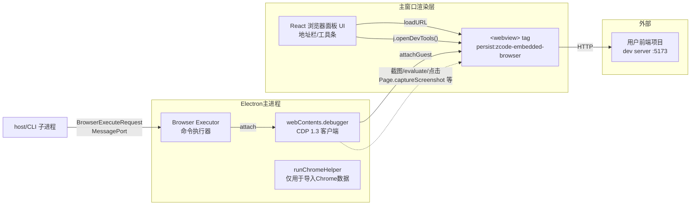
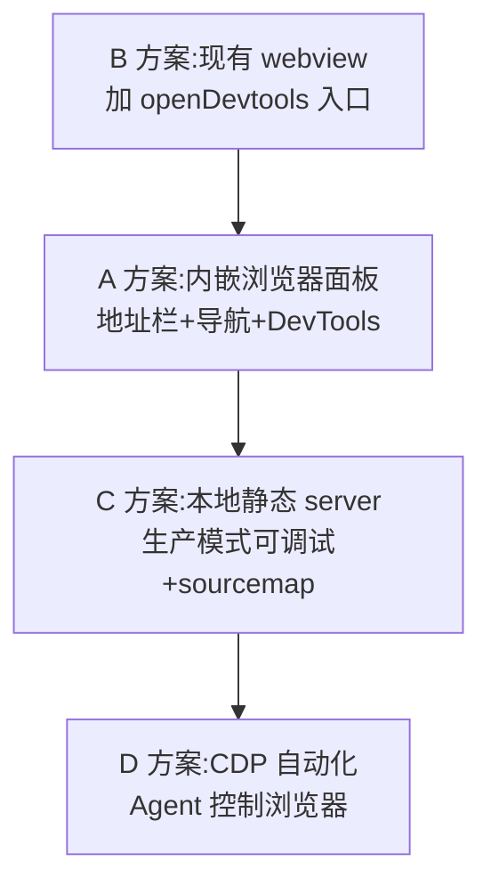
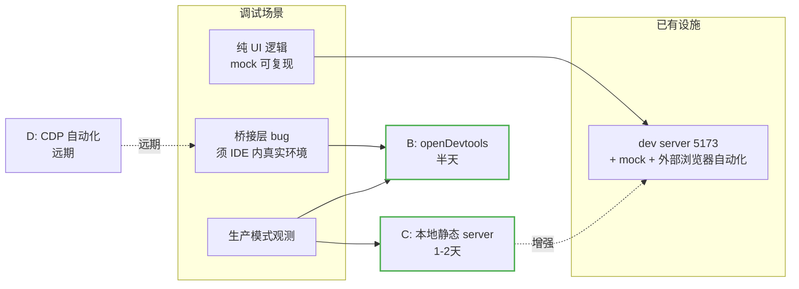

# 内嵌浏览器前端调试移植调研

> 调研日期：2026-08-15
> 背景：ZCode 桌面客户端有一个"前端调试浏览器"功能（用户描述为"起 webserver 内嵌浏览器进行调试"），希望移植到本 IntelliJ 插件。
> 调研方法：解包 ZCode 客户端 `app.asar`（v3.7.7，Electron）逆向其主进程/渲染层 bundle + IntelliJ Platform 官方文档。

---

## 一、TL;DR

1. **澄清一个关键误解：ZCode 客户端并不起任何 webserver**。逆向穷尽验证（`createServer` 0 次调用、无 express、无 `.listen(port)`、无自定义 protocol handler）。它的"内嵌浏览器"是 Electron `<webview>` 标签直接 `loadURL` 到**你前端项目自己起的 dev server**（如 vite 5173）。"webserver"其实是你项目的，客户端只提供"浏览器壳 + DevTools"。
2. IntelliJ 插件侧**所有等价能力都已具备**：`JBCefBrowser`（= webview）、`openDevtools()` / `getDevTools()`（= `webview.openDevTools()`）、`ide.browser.jcef.debug.port` 默认 9222 的 CDP 远程调试（= CDP attach）。**方案 A（内嵌浏览器面板）可以直接移植，工作量小**。
3. 顺手可解决本项目老痛点——**JCEF 无 DevTools**（生产模式 loadHTML 单文件、无 URL、无调试能力）。推荐的"起 webserver"正解是给插件加一个零依赖的本地静态资源 server（方案 C），让 webview 拥有真实 origin + sourcemap + 外部浏览器可调试。
4. **2026-08-15 会话实测修订**：依据当天幽灵补全排查会话走完的 AI 调试完整反馈环，落地顺序调整为 **B→C→A→D**（A 后移为产品需求）；**B + C 为互补必选组合**——B 补 IDE 内桥接层观测（mock 调不出协议 bug），C 补生产构建可调试性。详见第七节。

---

## 二、ZCode 客户端"内嵌浏览器"逆向结论

### 2.1 功能形态（用户视角）

主窗口右侧 side pane（与 Diff 面板同族）：

- 工具条：后退/前进/刷新、地址栏（placeholder"输入网址后回车"）、元素选择器（"选择网页元素加入聊天"，选中 DOM 元素带 background/color/font 属性注入聊天上下文）、响应式模式（"自由尺寸"：宽高+缩放+适应窗口）、"更多"菜单（"在默认浏览器中打开"、"打开调试工具"）
- 独立持久化 session：`partition="persist:zcode-embedded-browser"`（cookie/localStorage 与主窗口隔离）
- URL 协议白名单：主窗口 `will-attach-webview` 钩子强制覆写安全参数（sandbox/contextIsolation/独立 preload），仅允许 `about:/data:/http:/https:/zcode-browser-restore:`
- Tab 驻留/挂起/恢复机制（省内存，挂起后用伪协议 `zcode-browser-restore://pending` 占位）

### 2.2 技术架构



要点：

| 链路 | 实现 | 说明 |
|---|---|---|
| 用户开 DevTools | `<webview>.openDevTools()` | Electron 元素自带 API，独立 DevTools 窗口 |
| Agent（AI）控制 | 主进程 `webContents.debugger.attach("1.3")` → CDP | 截图（含 CSS 像素修正重拍）、`Emulation.setDeviceMetricsOverride`（响应式视口）、`Runtime.evaluate`、alert/confirm 拦截 |
| 命令协议 | host 进程 → MessagePort → 主进程 executor | `navigate/click(dom|cua)/scroll/screenshot/getState/evaluate/...` 命令集 |
| `--remote-debugging-port=0` | `runChromeHelper` | **与浏览器面板无关**，仅是"导入 Chrome 数据"功能借外部 headless Chrome 读 localStorage |

### 2.3 对移植最重要的结论

ZCode 的功能本质 = **"一个带地址栏和 DevTools 的内嵌浏览器面板"**，不含任何 server。被调试页面的服务由外部提供。

---

## 三、本项目现状对照

| 维度 | ZCode 客户端 | zcode-idea-plugin 现状 |
|---|---|---|
| 内嵌浏览器 | `<webview>` tag | `JBCefBrowser`（每标签页一个，`ZCodeToolWindowPanel.kt:116`） |
| 加载方式 | `loadURL`（真实 URL） | 生产：`loadHTML`（4.3MB singlefile 内联，无 origin）；dev：探测 5173 → `loadURL` |
| DevTools | `openDevTools()` 一键 | **无**（记忆确认：JCEF 无 DevTools 是老痛点） |
| 本地 server | 无 | 无（全量 grep 确认零 HTTP server 基础设施） |
| 前端独立调试 | — | bridge.ts mock fallback 已支持纯浏览器调试（`webview/src/ipc/bridge.ts:204`） |
| AI 控制浏览器 | CDP attach + 命令集 | 无 |

---

## 四、IntelliJ 平台可用能力（官方文档确认）

1. **`JBCefBrowser.openDevtools()`**：独立窗口打开 Chrome DevTools。⚠️ 已知坑：关闭 DevTools 弹窗时原 browser 可能被连带 dispose（JetBrains 支持论坛有报告，需实测）。
2. **`getDevTools()` 嵌入式用法**：`browser.getCefBrowser().getDevTools()` 返回 `CefBrowser`，再用 `JBCefBrowser.createBuilder().setCefBrowser(devTools).setClient(...).build()` 包装，可嵌入自己的 Swing 面板（如右侧分栏）。
3. **CDP 远程调试默认开启**：端口 9222（registry `ide.browser.jcef.debug.port` 可改）。外部 Chrome 打开 `http://localhost:9222` 即可 inspect；IDEA Ultimate 的 JavaScript 调试器可 "Attach to Node.js/Chrome"。
4. **右键菜单 DevTools**：仅 internal mode 且 `ide.browser.jcef.contextMenu.devTools.enabled=true` 才有，不可依赖。
5. **静态资源 serve**：官方文档明确"插件分发中的 HTML/CSS/JS 浏览器无法直接访问"，需 `CefRequestHandler + CefResourceRequestHandler` 映射资源路径（参考 `JCefImageViewer` / Markdown 预览 `MarkdownJCEFHtmlPanel`），或走本地 HTTP server。
6. JCEF API 在 platform 模块内（本项目 `plugins.set(listOf())` 零额外依赖即可用），运行时需 JBR with JCEF（现状已满足）。

---

## 五、移植方案分层

### 方案 B（先做，半天级）：给现有 webview 开 DevTools

在聊天 webview 的 `JBCefBrowser` 上加调试入口（工具条按钮 / 设置开关）：

```kotlin
// ZCodeToolWindowPanel 已有 jbCefBrowser 实例
RunInEdt { jbCefBrowser.openDevtools() }
```

立即消除"JCEF 无 DevTools"痛点；生产模式（loadHTML）下也能用（DevTools 对 data/html 文档同样工作）。

### 方案 A（核心移植，1~2 天）：内嵌浏览器面板

对齐 ZCode 体验，在 ToolWindow 里新增一个"浏览器"标签页/面板：

- `JBCefBrowser` + Swing 工具条：地址栏（回车 `loadURL`，自动补 `http://`）、后退/前进/刷新（`getCefBrowser().goBack()/goForward()/reload()`）、"打开调试工具"按钮（`openDevtools()`）、"在默认浏览器中打开"（`BrowserUtil.browse(url)`）
- 可选：嵌入式 DevTools 分栏（`getDevTools()` 包装后放 `JSplitPane` 右侧）
- 可选：URL 白名单（对齐 ZCode 的 `will-attach-webview` 管控理念）
- 创建/释放完全复用现有模式：Factory 建 Content + `content.setDisposer(panel)` + Service 注册表

主要场景：开发期地址栏填 `http://localhost:5173`，与 vite dev server + HMR 直接配合——这正是 ZCode 客户端的真实工作方式。

### 方案 C（"起 webserver"的正解，1~2 天）：插件内本地静态资源 server

若目标是"生产模式下 webview 也可调试"，给插件加一个本地 server serve webview 静态资源：

- 实现选型：**JDK 内置 `com.sun.net.httpserver.HttpServer`（零依赖，推荐）**，或 Netty（平台自带但属 internal API）；监听 `127.0.0.1` 随机端口，serve 插件 classpath `/webview/**` 资源
- 替代路线：自定义 scheme（如 `zcode://webview/`）+ `CefResourceRequestHandler`（无端口占用，官方参考 `JCefImageViewer`），但 API 学习成本更高，且外部浏览器打不开（无法"复制 URL 到 Chrome 调试"）
- 收益：
  1. `loadHTML`（4.3MB 内联）→ `loadURL(http://127.0.0.1:port/)`，真实 origin，localStorage 行为正常
  2. 可以打包 sourcemap，DevTools 里直接看 TS/TSX 源码、下断点
  3. 外部浏览器打开同 URL + bridge.ts 的 mock fallback = 不进 IDE 也能调试
  4. singlefile 打包可降级为 fallback（server 起不来时兜底）
- 注意：server 生命周期挂 `ZCodeService`（lazy 启动 + dispose 关闭）；仅绑 127.0.0.1；MIME 类型映射（.js/.css/.woff2/.map）

### 方案 D（远期）：Agent CDP 自动化（Browser Use 对等物)

ZCode 的 Agent 控制链路（截图/点击/evaluate 注入聊天）在插件侧的等价物：

- JCEF 无 `webContents.debugger` 直接等价 API，但 **9222 CDP 端口默认开启**，Java 侧可用 CDP over WebSocket 客户端（chrome-devtools-java-client / 自写轻量 WS 客户端）连 `http://localhost:9222/json/list` 取 target
- 可实现：截图回传给 AI（对齐本项目"子代理详情弹窗"的图片渲染）、`Runtime.evaluate`、DOM 交互
- 风险：9222 是 IDE 级共享端口（IDE 内所有 JCEF 实例并列），多标签页需按 target/title 区分；社区生态库质量参差
- 建议远期单独立项，不与 A/B/C 捆绑

### 推荐落地顺序



B → A 是"移植 ZCode 功能"的最小闭环；C 解决本项目自身调试痛点；D 为进阶。

> ⚠️ **修订（2026-08-15）**：会话实测后落地顺序调整为 **B → C → A → D**，理由与依据见第七节；本节顺序为初始调研结论，保留供追溯。

---

## 六、风险与坑清单

| 风险 | 说明 | 对策 |
|---|---|---|
| `openDevtools()` 连带 dispose | 关闭 DevTools 窗口可能把宿主 browser 一起 dispose（论坛已知问题） | 实测；必要时改用 `getDevTools()` 自管生命周期 |
| 9222 端口冲突/被占 | IDE 级端口，被占时 CEF 静默降级 | registry 可改端口；文档化到 README |
| loadHTML 模式 DevTools 体验 | 无 sourcemap、无 origin | 方案 C 落地后消除 |
| JDK HttpServer 单线程默认 | 默认线程池小，静态资源够用 | 固定 `setExecutor`；资源响应流式化 |
| 多标签页 CDP target 混淆 | 9222 上列出 IDE 全部 JCEF 实例 | 方案 D 时按 `cefBrowser.getURL()` 过滤 |
| JCEF 环境 | 目标 IDE 需 JBR with JCEF | 现有 `JBCefApp.isSupported()` 门控已覆盖 |

---

## 七、会话实测对照与结论修订（2026-08-15）

> 依据：当天"输入提示与补全失效"排查会话（`isCaretAtEnd` 跨容器比较缺陷），走完 AI 调试 webview 前端的完整反馈环：dev server + mock + 浏览器自动化（DOM 读取/坐标点击/键盘注入）+ 源码探针 + HMR，端到端统计验证 10/10 通过。据此校验本文各方案的真实覆盖面。

### 7.1 实测提炼的调试能力需求

| # | 能力需求 | 实测状态 |
|---|---|---|
| R1 | 独立环境起前端（dev server + mock fallback） | ✅ 已具备，全流程未受阻 |
| R2 | 页面导航/刷新/等待控制 | ✅ 正常 |
| R3 | 读 DOM 状态（结构/属性/文本） | ✅ locator + getAttribute 稳定可用 |
| R4 | UI 操控（点击/键盘） | ⚠️ 可用；坐标点击探测失败 1 次、按键偶发丢失 2 次（同操作 10/10 复测通过，判定为测试通道偶发而非代码问题） |
| R5 | 读 JS 运行时（localStorage/组件状态/执行探测代码） | ❌ 被 IAB debug-evaluate 保守拒绝（`localStorage.getItem`、`createRange` 均判为 side-effect），被迫改用探针通道（见 7.4） |
| R6 | 截图 / console 日志读取 | ❌ IAB guest 截图捕获失败；console 无读取通道 |

**重要澄清**：R5/R6 的失败是 **ZCode 客户端 IAB 环境的限制，不是插件项目调试环境的限制**——普通 Chrome + Playwright/CDP 下这些通道全部正常。因此"纯前端逻辑调试"依赖现有设施（dev server + mock fallback + 外部浏览器自动化）**已经闭环**，不依赖本文任何方案。真正的缺口是 mock 覆盖不了的另一半：**桥接层（Java↔JS 协议）bug 与生产模式观测**。

### 7.2 方案满足度对照

| 需求场景 | B (openDevtools) | A (浏览器面板) | C (本地 server) | D (CDP 自动化) |
|---|---|---|---|---|
| 纯 UI 逻辑调试（mock 可复现） | 人工可调 | 人工可调 | ✅ AI 自动化 + sourcemap 全覆盖 | ✅ 过度 |
| 桥接层 bug（协议流，-32031/stderr 管道类） | ✅ IDE 内 console 可看真实桥接日志 | 同 B | ⚠️ 外部浏览器开 URL 走 mock fallback，看不了真实桥接 | ✅ |
| 生产模式（IDE 内真实运行） | ✅ console/断点 | 同 B | ✅ 真实 origin + sourcemap + 外部可访问 | ✅ |
| 源码级断点（TS/TSX） | ❌ loadHTML 无 sourcemap | ❌ 同左 | ✅ | — |
| AI 自动操控 IDE 内 webview | ❌ | ❌ | ❌（外部可操控但非 IDE 内） | ✅ 唯一覆盖 |



### 7.3 结论修订

1. **最优单选 = C，但 B 必须先行，两者互补缺一不可**：
   - B 补"IDE 内人工观测真实桥接日志"——桥接协议 bug（-32031、stderr 管道阻塞、ExitPlanMode 审批协议等踩过的坑全在此层）mock 复现不了，只能在 IDE 内真实环境看 console；
   - C 补"生产构建像 dev 一样可被外部工具调试"（真实 origin、sourcemap、外部浏览器/自动化可访问、singlefile 降级兜底）；但 C 落地后外部开生产 URL 依然是 mock fallback——桥接观测仍只能靠 B。
2. **落地顺序修订为 B → C → A → D**（覆盖第五节初始结论）：
   - A 后移理由：本会话全流程未用到 IDE 内浏览器面板，开发者用外部 Chrome 开 5173 更顺手；A 的价值是"对齐 ZCode 产品体验"，属产品功能需求，不应占调试排期；
   - C 的隐藏收益：AI 可对生产构建跑自动化回归（本会话的 10 轮统计验证流程可直接用于发版前验收）；
   - D 维持远期：它解决"Agent 操控用户正在使用的 IDE 内界面"，与调试流程是两个问题，9222 共享端口风险真实。
3. **B 的实施风险提醒**（衔接第六节）：`openDevtools()` 连带 dispose 坑在 IDE 内生产环境的影响面大于 dev 环境（用户正在使用的会话），上线前必须实测关闭 DevTools 窗口的行为。

### 7.4 调试手法沉淀：data 属性探针通道

evaluate 不可用（或 IDE 内无自动化通道）时的诊断数据回路，本会话实测有效：

1. 源码内在诊断点把判定链各环节写成 JSON 挂到 DOM：`el.dataset.dbgGhost = JSON.stringify({...})`；
2. 外部用 `getAttribute('data-dbg-ghost')` 读出（locator 读取不受 debug-evaluate 限制）；
3. 配合 vite HMR 秒级生效——改探针→浏览器刷新→读数，比 console.log 高效（console 无读取通道时等于盲打）；
4. **纪律**：探针须带统一标记前缀（如 `[DEBUG-gh]`），收尾 `grep` 前缀一次性清理，防止诊断代码残留。

## 八、参考

- [Embedded Browser (JCEF) | IntelliJ Platform Plugin SDK](https://plugins.jetbrains.com/docs/intellij/embedded-browser-jcef.html)
- [JCEF reference guide (WebContentsView/DevTools 示例)](https://github.com/hltj/intellij/blob/master/reference_guide/jcef.md)
- [JBCefBrowser DevTools 关闭问题（JetBrains 支持论坛）](https://intellij-support.jetbrains.com/hc/en-us/community/posts/7622835183250-JBCefBrowser-devtools-close-issue)
- 逆向样本：ZCode v3.7.7 `app.asar`（分析后已清理）
